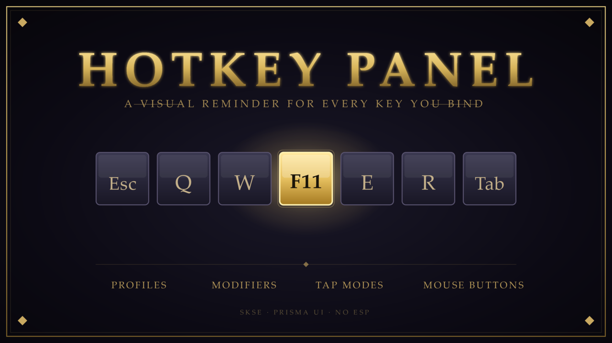

# Hotkey Panel

A visual hotkey reminder for Skyrim SE/AE. Press one key, see a full keyboard +
mouse overlay where every binding from every mod can be labeled, color-coded,
and grouped into per-mod profiles. Pure SKSE plugin — no ESP, no Papyrus, no
load-order slot consumed.



## Features

- **Full 104-key ANSI keyboard** + 11-button gaming-mouse overlay
- **Per-mod profiles** — label the same key differently for Frostfall vs. SkyUI vs. Requiem
- **Tap modes** — single / double / long-press each get their own labels and colors
- **Modifier layers** — mark any key as a modifier; bindings stack (Shift+Ctrl = its own layer)
- **Per-profile color overrides** — KeyA red in DEFAULT, blue in Frostfall, restored when you switch back
- **In-UI toggle key rebinding** — change the open/close key without editing INIs
- **Resizable + transparent** — panel scale 12–100 %, opacity 20–100 %, persisted across saves
- **Game-pause + input isolation** — the panel pauses the world; other mods' `RegisterForKey` handlers don't fire while it's open
- **Pure SKSE** — no ESP, no .pex, no Papyrus VM cost
- **Persistence in JSON** — `Data/SKSE/Plugins/HotkeyPanel/hotkeys.json` (atomic writes, `.bak` on every save), survives new games

## Requirements

| Dependency | Why |
|---|---|
| [SKSE64](https://skse.silverlock.org/) | Plugin host |
| [Address Library for SKSE Plugins](https://www.nexusmods.com/skyrimspecialedition/mods/32444) (SE) / [AE flavor](https://www.nexusmods.com/skyrimspecialedition/mods/32444) | Runtime version independence |
| [PrismaUI](https://www.nexusmods.com/skyrimspecialedition/mods/100250) | HTML/JS overlay engine that renders the panel |

Works on **all Skyrim SE/AE runtimes Address Library supports** (1.5.x SE, 1.6.x AE). Not VR.

## Install

Just drop the contents of `dist/` into your Skyrim Data folder (or install the
release ZIP via Mod Organizer 2 / Vortex). Default toggle key is **F11** — open
the panel, hit Settings, pick a different key if F11 conflicts with something
else in your load order.

## Source layout

```
src/                  C++ SKSE plugin sources
  plugin.cpp          SKSE entry, logger setup, message callbacks
  PrismaUIBridge.*    Creates the PrismaUI view, registers JS listeners,
                      bridges JS → game and back
  InputHandler.*      BSInputDeviceManager sink — owns the toggle key,
                      menu blocklist, Esc/Tab close, input swallow while open
  JsonStore.*         Atomic load/save of hotkeys.json
include/
  PrismaUI_API.h      Public PrismaUI SDK header (used for plugin API binding)
dist/                 Files shipped to the player's Data folder
  PrismaUI/views/HotkeyPanel/
    index.html        Panel structure
    css/hkp.css       Skyrim-styled CSS — gold/dark, EB Garamond serif
    js/hkp.js         All UI logic, state, persistence, key/mouse rendering
    img/mouse_clean.png  Mouse silhouette (transparent background)
branding/             Nexus banner + thumbnail (SVG + PNG)
CMakeLists.txt        Build config (CommonLibSSE-NG via vcpkg)
vcpkg.json            Pinned deps
build.bat             One-shot build + deploy script (MSVC + Ninja)
```

## Build from source

Requires Visual Studio 2022+ with C++ build tools, CMake 3.21+, [vcpkg](https://vcpkg.io/),
and `VCPKG_ROOT` set in your environment.

```cmd
git clone https://github.com/StinkyPumpkin/HotkeyPanel.git
cd HotkeyPanel
build.bat
```

The build script outputs `HotkeyPanelPrisma.dll` and copies it (plus the
PrismaUI views) to a Mod Organizer 2 mod folder. Edit `OUTPUT_FOLDER` in
`CMakeLists.txt` (or set `SKYRIM_MODS_FOLDER` env var) to retarget.

## Architecture

```
┌─────────────────────────────────────────────────────────────────┐
│  Skyrim runtime                                                 │
│                                                                 │
│  ┌────────────────────────┐         ┌──────────────────────┐    │
│  │ HotkeyPanelPrisma.dll  │         │ PrismaUI.dll         │    │
│  │ ─────────────────────  │  API    │ ─────────────────    │    │
│  │ InputHandler           │ ◄────►  │ V8 + HTML overlay    │    │
│  │ PrismaUIBridge         │         │ DX11 input hook      │    │
│  │ JsonStore              │         │ Menu shell           │    │
│  └────────┬───────────────┘         └──────────┬───────────┘    │
│           │                                    │                │
│  ┌────────▼────────┐                  ┌────────▼───────────┐    │
│  │ BSInputDevice   │                  │ index.html + JS    │    │
│  │ Manager sink    │                  │ (hkp.js — 970 LOC) │    │
│  │ (kStop on view  │                  │                    │    │
│  │  visible)       │                  │ Renders keyboard,  │    │
│  │                 │                  │ mouse, profiles,   │    │
│  │ Toggle / Tab /  │                  │ color swatches,    │    │
│  │ Esc close keys  │                  │ modifier layers    │    │
│  └─────────────────┘                  └────────┬───────────┘    │
│                                                │                │
│                                                ▼                │
│                                       hotkeys.json (state)      │
└─────────────────────────────────────────────────────────────────┘
```

Settings flow: JS dispatches `hkpSetToggleKey` and the C++ `PrismaUIBridge`
listener calls `InputHandler::SetToggleKey()` to update the active toggle key.
State persists via `hkpSaveState` → `JsonStore::Save()` with atomic
temp+rename + .bak rotation.

## Credits

- **PrismaUI** by Nezvers — the HTML/JS overlay engine this depends on
- **CommonLibSSE-NG** — SKSE plugin framework
- **Bethesda** — Skyrim, obviously

## License

MIT — see [LICENSE](LICENSE).
